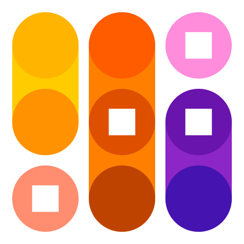

DesignSpaceEditor2
==================

Create and edit designspaces with Robofont 4.5+, with support for scripting.

## Documentation

 (or click the (?) symbol in the toolbar.)

## Goals

 * Open, edit and save existing  files.
        >
 * You can create a new designspace and fill it with axes, sources and instances.
 * You can edit all sorts of axis labels, location labels and localisations.
 * You can quickly open the UFOs listed as sources.
 * You can generate UFOs for defined instances.
 * You can preview and add instances.
 * You can validate designspaces and find compatibility and structural issues.
 * DSE2 collects and sends designspace-related notifications about changes to the designspace, and also changes in the source font data. Other tools in RF can request interpolated glyphs, kerning and font info at specific locations, using MutatorMath as well as Varlib interpolation models.
 * You can experiment with *extrapolation* and *anisotropic interpolations* and see previews for such exotic things. *Even if these are not supported as Variable fonts, you can export them as UFO.*
* You can write scripts that use the current designspace.

