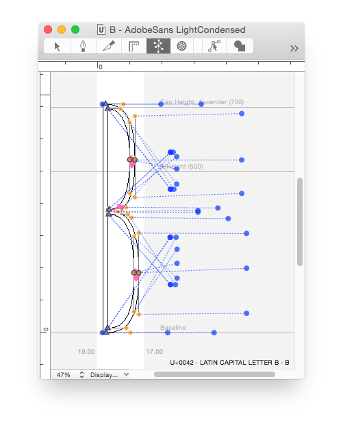

# DesignSpaceEditor


An **experimental** RoboFont extension to create and edit designspace files. If you want a **preview**, **measuring tools**, more than **5 axes** and a **nice graphic** representation of the design space, have a look at [Superpolator](http://new.superpolator.com/home/order/). For a specification of the **designspace** format go [here](https://github.com/LettError/designSpaceDocument).

* Open, edit and save existing designspace files.
* Start new designspace files.
* Open master UFOs
* The window does not behave like a document yet. The save button is clumsy at the moment.
* Some new elements in the designspace that are not yet part of MutatorMath.
* Should be compatible with **MutatorMath** and **FontTools.varlib**.

## Usage
1. Open an existing designspace file or start a new one.
1. Define some axes. Give them useful names.
1. Then load some masters.
1. Then save the document in the same folder as your masters, or one level up. The document will store a relative path to the masters and instances.
1. Define instances and whatever else you need to do.
1. Save. 

Yes, I know you can write the xml by hand, 
but ¯\\\_(ツ)__/¯.


## Notes
* This extension uses the [DesignSpaceDocument](https://github.com/LettError/designSpaceDocument) reader and writer.
* The editor does not support **anisotropic** designspace locations (variable fonts don't either). If you open a file with an anisotropic coordinate (for instance exported from Superpolator) only the horizontal value will be used.
* The `Generate` button in the toolbar will not work in older RoboFont (<1.8b) versions. 
* If you open a designspace exported from **Superpolator** that contains rules, the specific glyph masters will not be editable in this version.
## Toolbar

* `Save` saves the file.
* `Add Open Fonts` adds all open UFOs to th Masters list.
* `Generate` feeds this designspace to the **MutatorMath** embedded in RoboFont and it will attempt to generate the instances as well as it can.
* `Settings` provides a sheet with some preferences. At the moment: just the name of the folder for the instances.

## Axes
* This editor supports up to **five** different axes in a single file. Use [Superpolator](http://superpolator.com) if you need more.
* Use the `+` button to create a new axis.
* Rename the axis to what you need. If you type one of the registered OpenType axis names (**weight**, **width**, **optical**, **slant** or **italic**, all lowercase) with the right tag a comforting `✓` appears next to the axis name to indicate this is indeed a standard axis.
* **Minimum** value, **maximum** value are the boundaries of the axis.
* **Default** is the default value on the axis for new instances.
* For unregistered axes you'll be able to add a **labelname**. This name is intended for user-facing UI labeling. It will use `xml:lang="en"` for these entries. This field is not yet fully supported in the varlib tools.
* You can rename the axis name in the list, but you can't change it to an existing name.
* The **Map** column shows axis user space to design space mappings. Enter comma-separated values as a single string (lame, but it works). For instance: `0, 10, 200, 700, 1000, 990` will save as:

```python
<map input="0.0" output="10.0" />
<map input="200.0" output="700.0" />
<map input="1000.0" output="990.0" />
```
**Note:** when you open an old designSpaceDocument file that does not contain an `axes` element, it will create axis objects based on the names and coordinates of the masters and instances in the document. You might want to edit this afterwards.

## Masters
* Use the `+` button to add one or more UFO masters: a file dialog will appear.
* Use the `-` button to remove a master. A dialog will appear to make sure.
* Use the `Open` button to open the selected UFOs in RoboFont. Instant editing!
* In the toolbar, use the `Add Open Fonts` button to add all open fonts at once. 
* If the UFO for a master can be found then a `✓` appears next to the name.
* Use the `Make Default` button to make the selected master the default: it sets the **lib**, **groups** and **info** flags for this master. The 🔹indicates the current default.
* Use the `Load Names` button to load the **family name** and **style name** from the UFO.
* The relative pathname to the master UFO is editable as text (so you need to know what you're doing!)

## Instances
* After adding two or more masters you can add instances using the `+` button.
* Remove selected instances with the `-` button. Again, a dialog will appear to make sure.
* Add a **family name** and a **style name** for the instance.
* Add axis values.
* A proposed UFO name will appear. This can't be edited at the moment.
* Use the `Duplicate` button to duplicate a selected instance.
* If the UFO for an instance can be found then a `✓` appears next to the name. If it exists you can use the `open` button to open it in RoboFont.
* The relative pathname to the instance UFO is editable as text (so you need to know what you're doing!)

## Rules
The rules panel is experimental. It is possible to define and edit rules and conditions. But these are not actually supported anywhere. [More discussion of the rules elements here.](https://github.com/LettError/designSpaceDocument#rules)

## Report
* This panel shows a very basic validation report of what needs to be done and where the UFOs are, etc.

## ShowSparksTool
A small interpolation visualiser for the Edit window.

* Shows the current glyph from **all open UFOs** (maybe that should be limited, idk.).
* Edit Tool, so you can do all the editing with this visualiser on.
* Does not preview interpolation, or do anything with the designspace data.
* Does not attempt to repair problems.
* Just draws one to one relations of the points.
* If the number of points in one of the masters does not match the others, the lines will be red.



## Todo
* Separate validation for MutatorMath and Varlib use.

## History

* 1.0 Initial commit
* 1.1 Fixes a mistake with packaging.
* 1.3.2 UFO paths are editable.
* 1.3.3 Updated designSpaceDocument.
* 1.3.5 Updated designSpaceDocument. ShowSparksTool added.
