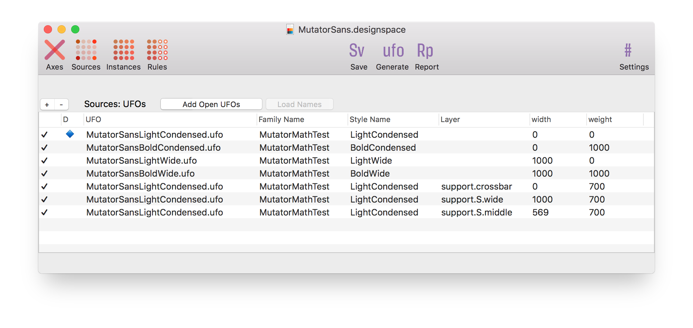

# DesignSpaceEditor


A RoboFont extension to create and edit designspace version 4 files. If you want a **preview**, **measuring tools**, more than **5 axes** and a **nice graphic** representation of the design space in [RoboFont](https://robofont.com), have a look at [Skateboard](https://letterror.com/tools/skateboard.html). For a specification of the **designspace** format go [to the designspace specification at the FontTools repository](https://fonttools.readthedocs.io/en/latest/designspaceLib/index.html).

* Open, edit and save existing designspace files.
* Start new designspace files.
* Open source UFOs
* The window does not behave like a document, the save button is clumsy.

## Usage
1. Open an existing designspace file or start a new one.
1. Define some axes. Give them useful names.
1. Then load some source UFOs.
1. Then save the document in the same folder as your sources, or one level up. The document will store a relative path to the sources and instances.
1. Define instances and whatever else you need to do.
1. Save. 

Yes, I know you can write the xml by hand, 
but ¯\\\_(ツ)__/¯.



This editor does not support **anisotropic** designspace locations (variable fonts don't either). If you open a file with an anisotropic coordinate (for instance exported from Superpolator) only the horizontal value will be used.

## Toolbar
* `Save` saves the file.
* `Add Open Fonts` adds all open UFOs to th Masters list.
* `Generate` feeds this designspace to the **MutatorMath** embedded in RoboFont and it will attempt to generate the instances as well as it can with [UFOProcessor](https://github.com/LettError/ufoProcessor).
* `Settings` provides a sheet with some preferences. At the moment: just the name of the folder for the instances.

## Axes
* This editor supports up to **five** different axes in a single file.
* Use the `+` button to create a new axis.
* * Use the **Add weight**, **Add width**, **Add optical** buttons to add quick, default axes.
* Rename the axis to what you need. If you type one of the registered OpenType axis names (**weight**, **width**, **optical**, **slant** or **italic**, all lowercase) with the right tag a comforting `✓` appears next to the axis name to indicate this is indeed a standard axis.
* **Minimum** value, **maximum** value are the boundaries of the axis.
* **Default** is the default value on the axis for new instances.
* For unregistered axes you'll be able to add a **labelname**. This name is intended for user-facing UI labeling. It will use `xml:lang="en"` for these entries. If you need to do more localised names, edit the xml. 
* You can rename the axis name in the list, but you can't change it to an existing name.
* The **Map** column shows axis user space to design space mappings. Enter comma-separated values as a single string (lame, but it works). For instance: `0, 10, 200, 700, 1000, 990` will save as:

```python
<map input="0.0" output="10.0" />
<map input="200.0" output="700.0" />
<map input="1000.0" output="990.0" />
```

## Sources
* Use the `+` button to add one or more UFO sources: a file dialog will appear.
* Use the `-` button to remove a source. A dialog will appear to make sure.
* Use the `Open` button to open the selected UFOs in RoboFont. Instant editing!
* In the toolbar, use the `Add Open Fonts` button to add all open fonts at once. 
* If the UFO for a source can be found then a `✓` appears next to the name.
* Use the `Load Names` button to load the **family name** and **style name** from the UFO.
* The `Replace UFO` button lets you replace the selected UFO with a new one. The location will remain the same.
* The relative pathname to the source UFO is editable as text (so you need to know what you're doing!)

## Instances
* After adding two or more sources you can add instances using the `+` button.
* Remove selected instances with the `-` button. Again, a dialog will appear to make sure.
* Add a **family name** and a **style name** for the instance.
* Add axis values.
* A proposed UFO name will appear. This can't be edited at the moment.
* Use the `Duplicate` button to duplicate a selected instance.
* The `Automatic UFO names` checkbox will, when checked, update the UFO names according to the `familyName-styleName.ufo` pattern.
* If the UFO for an instance can be found then a `✓` appears next to the name. If it exists you can use the `open` button to open it in RoboFont.
* The relative pathname to the instance UFO is editable as text (so you need to know what you're doing!)

## Rules
It is possible to define and edit rules and conditions that can convert to `rvrn` features if compiled.

## Problems
* This panel shows a very basic validation report of what needs to be done and where the UFOs are, etc. This uses the [DesignspaceProblems](https://github.com/LettError/DesignspaceProblems) package.


## History

* 1.0 Initial commit
* 1.1 Fixes a mistake with packaging.
* 1.3.2 UFO paths are editable.
* 1.3.3 Updated designSpaceDocument.
* 1.3.5 Updated designSpaceDocument. ShowSparksTool added.
* 1.3.6 Updated designSpaceDocument. ShowSparksTool made independent.
* 1.9.6
	* Update of this readme
	* Resizable columns thanks [@ryanbugden](https://github.com/ryanbugden)!
	* Quick defaults for axes
	* Replace UFO button
	* Automatic update of UFO name based on `familyName-styleName.ufo`
