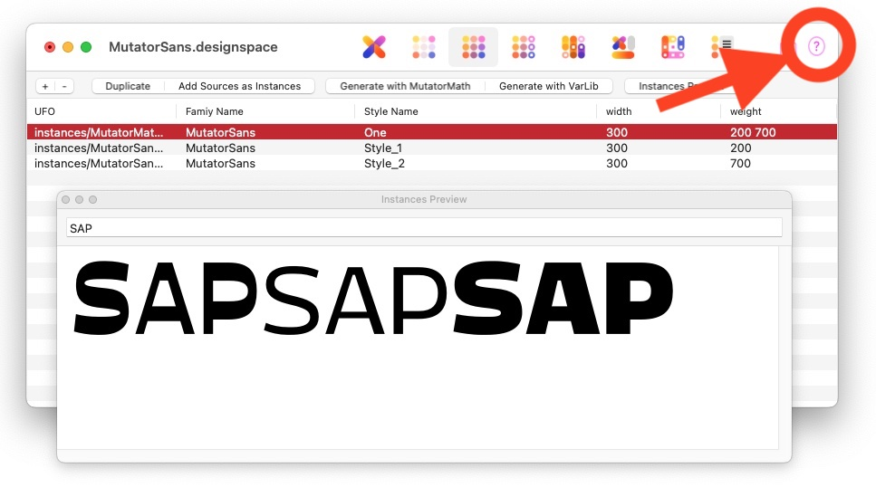

DesignSpaceEditor2
==================

An extension for RoboFont 4.4+ to create and edit designspaces format 4 and 5. Labels, variable fonts, mappings can be edited in a compact syntax, examples on this page. For the **designspace** 5 format go [to the specification at FontTools](https://fonttools.readthedocs.io/en/latest/designspaceLib/index.html).

This extension can:

*   DesignSpaceEditor2 is for very recent RoboFont 4.4+ only.
*   Open, edit and save existing designspace format 4 and format 5 files.
*   Support discrete axes.
*   You can start a new designspace.
*   You can edit all sorts of labels and localisations.
*   You can open source UFOs.
*   Validate designspaces and point out compatibility and structural issues.
*   DesignspaceEditor2 sends designspace-related notifications.

Please refer to the documentation in the DSE extension. Click the (?) button
.

```python
# example of CurrentDesignspace()
```

## Scripting with the current designspace

With a document open in DesignspaceEditor you can call `CurrentDesignspace()`, similar to `CurrentFont()` and `CurrentGlyph()``. This returns the designspace wrapped in a `UFOOperator` object that can handle all the glyph interpolations, font info, kerning etc.

### Calculating a glyph

The example below calculates a single glyph at the default location. It returns a mathGlyph.

```python
d = CurrentDesignspace()
loc = d.newDefaultLocation()
g = d.makeOneGlyph("A", location=loc)
```

### Calculating kerning and info

The example below calculates a single kerning pair and an info object. The `makeOneKerning` method accepts a list of pairs to calculate. If no pairs are given, all pairs will be calculated. So there is an incentive, if you're doing this math for an interactive thing, be precise about which pairs you really need and only calculate those.

```python
d = CurrentDesignspace()
loc = d.newDefaultLocation()

pairs = [('public.kern1.i', 'public.kern2.b')]
kern = d.makeOneKerning(loc, pairs)
print(kern.items())

info = d.makeOneInfo(loc)
print(info)
```
### Calculating an instance and drawing in Drawbot

With the Drawbot extension in RoboFont, you can call `CurrentDesignspace()` and draw interpolated glyphs. 

```python
size(1000, 500)
d = CurrentDesignspace()
fill(None)
stroke(0)
strokeWidth(.5)
with savedState():
    translate(100, 100)
    scale(0.5)
    for i in range(20):
        loc = d.randomLocation()
        g = d.makeOneGlyph("A", location=loc)
        bp = BezierPath()
        g.draw(bp)
        drawPath(bp)
```

### Useful methods of the UFOOperator object

`CurrentDesignspace` returns a `UFOOperator` object representing the designspace you opened. To see the whole machine, please check UFOOperator at [GitHub source here](https://github.com/LettError/ufoProcessor/blob/master/Lib/ufoProcessor/ufoOperator.py). `UFOOperator` takes care of the loading the fonts, it builds interpolators for all the things, (in varlib and mutatormath flavors), it understands anisotropic interpolations, and it can handle extrapolation. `UFOOperator` also keeps a cache of results, so there is some efficiency. The object is pretty easy to script with as well.

`UFOOperator` has the same attributes as the fonttools designspace object. Building a new designspace with UFOOperator is very similar to what [is described here](https://fonttools.readthedocs.io/en/latest/designspaceLib/scripting.html).
```python
d = CurrentDesignspace()
print(d.sources)
print(d.instances)
print(d.axes)
```

In general: `useVarlib=True`: the fonttools.varlib model will be used for interpolations. `useVarlib=False`: the  mutatorMath model will be usef for interpolations. The Varlib model is very close to how Variable Fonts work. MutatorMath is a bit more flexible: it can do anisotropic interpolation. Both models can extrapolate now, though their results might not be the same if there are unaligned, off-axis masters in the system.

Also, UFOOperator will assume locations are in designspace locations. You can use the `bend` argument to indicate that a location has to be mapped. The competing coordinate systems can be a bit confusing, especially if you use userLocations in the instances. But before you assume the code is getting the wrong results, check your axis mappings and locations, and make sure you are passing the right type to UFOOperator. If you're sure the location is in designspace coordinates, leave `bend=False`. 

There are some useful methods that split locations into their continuous and discrete values. Make sure that each value you enter for a discrete axis actually has sources, because each value is expected to represent a whole interpolating system!

* `**makeOneGlyph**(glyphName, location, decomposeComponents=True, useVarlib=False, roundGeometry=False, clip=False)` make a glyph for this location.
* `**makeOneInfo**(location, roundGeometry=False, clip=False)`: make an info object for this location.
* `**makeOneKerning**(location, pairs=None)` make a kerning object for this location. `pairs` optional list of pairs to include.


* `**loadFonts**()`: the designspace you get from CurrentDesignspace already has the fonts loaded. But remember there is a method to do so.\
* `**updateFonts**(fontObjects)`: fontObjects is a list of RF font objects that are to be used in the designspace. If you want to explicitly want to put new fonts in the machine.
* `**getFonts**()` returns a list of (font object, location) tuples.
* `**getCharacterMapping**(discreteLocation=None)` returns a unicode -> glyphname map for the default of the whole system or discreteLocation. As the defaults at discrete locations can be quite different, UFOOperator makes no assumptions about what is available.


* `**findDefault**(discreteLocation=None)` returns the default location for the system or the discrete location.
* `**findDefaultFont**(discreteLocation=None)`:  returns the default fontObject for the system or the discrete location.
* `**splitLocation**(location)`: returns the location split into a continouous and a discrete part
* `**getFullDesignLocation**(location)`: returns the given location converted to designspace coordinates.
* `**getDiscreteLocations**()`: return a list of all possible discrete locations for this system.
* `**newDefaultLocation**(bend=False, discreteLocation=None)`: returns a new location that is on the default of all axes. Use `bend=True` to get a default in user space coordinates. Use `bend=False` to get the default in designspace coordinates. Pass a discreteLocation dict to get the default at that discrete location.
* `**isAnisotropic**(location)` returns True if this location is anisotropic.
* `**splitAnisotropic**(location)` returns the x and y components of this location as two separate location dicts.
* `**generateUFOs**(useVarlib=None)`: generate all the available instances as UFOs. This will calculate all glyphs, kerning, and font info for each instance. While pretty fast, this will take a bit of time. At whichever path is stored in the instanceDescriptors. If no instances are defined, nothing will generate.
* `**getLocationType**(location)` returns `anisotropic, continuousLocation, discreteLocation, locHorizontal, locVertical`.
* `**makeInstance**(instanceDescriptor, glyphNames=None, decomposeComponents=False, pairs=None, bend=False)` this makes a single UFO instance. `glyphNames` is an optional list of glyph names to exclusively generate. `decomposeComponents` can be True to decompose all glyphs. This is useful when generating small sets of outlines for a preview. `pairs` is an optional list of kern pairs to make. If none are give, all kerning will be calculated.
* `**randomLocation**()` returns a good random location, for quick testing and entertainment.
  * `**extrapolate`: is a factor of the (max-min) distance. 0 = nothing, 0.1 = 0.1 * (max - min).
  * `**anisotropic= True`: *all* continuous axes get separate x, y values
  * for **discrete** axes: random selection from the defined values.
  * for **continuous** axes: interpolated value between axis.minimum and axis.maximum
  * Note: this returns a designspace location, not a userspace location.
* `**makeFontProportions**(location, bend=False, roundGeometry=True)`: Calculate the basic font proportions for this location, to map out expectations for drawing.
