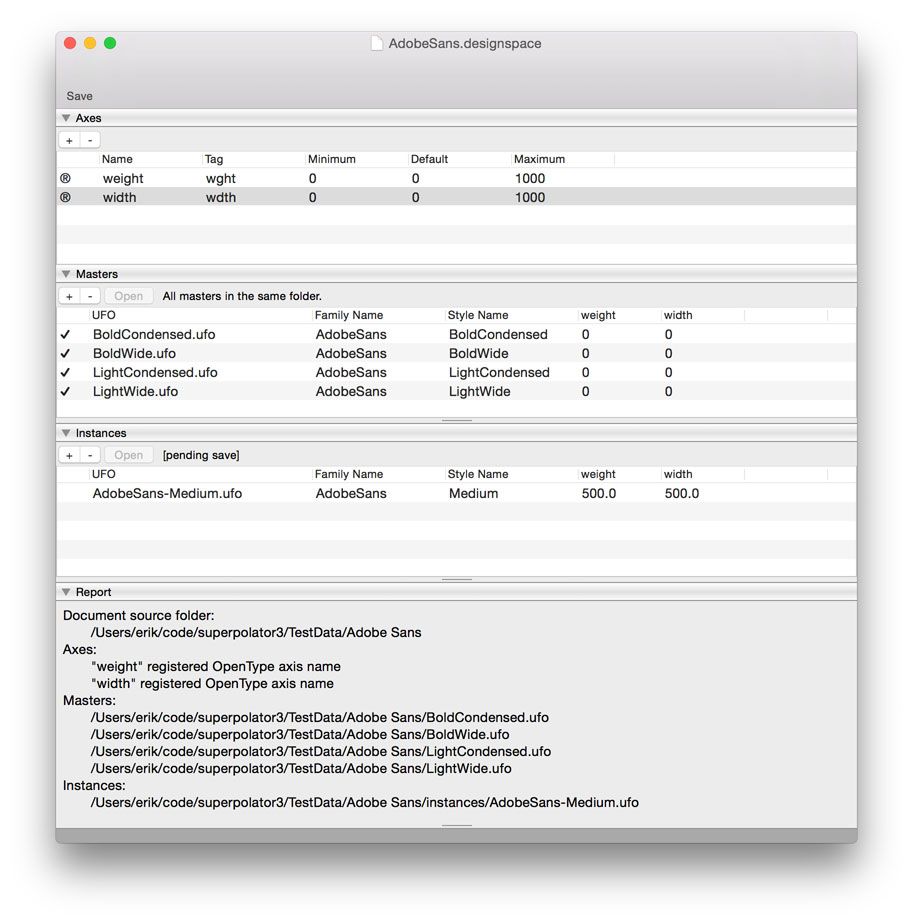

# DesignSpaceEditor

An **experimental** RoboFont extension to create and edit designspace files. If you want a preview, measuring tools and a nice graphic representation of the design space, have a look at [Superpolator](http://new.superpolator.com/home/order/)

* Open, edit and save existing files
* Start new files.
* Open master UFOs
* The window does not behave like a document yet. The save button is clumsy at the moment.
* Some new elements in the designspace that are not yet part of MutatorMath.

## Axes
* Use the `+` button to create a new axis.
* Rename the axis to what you need. If you type one of the registered OpenType axis names (*weight*, *width*, *optical*, *slant* or *italic*) the tag will be filled in automatically and a comforting `✓` appears next to the axis name to indicate this is indeed a standard axis.
* Minimum value, maximum value are the boundaries of the axis.
* Default is the default value on the axis for new instances.
* For unregistered axes you'll be able to add a *labelname*. This name is intended for user-facing UI labeling. It will use `xml:lang="en"` for these entries. 

## Masters
* Use the `+` button to add masters: a file dialog will appear and you can select a UFO.
* Use the `-` button to remove a master. A dialog will appear to make sure.
* Use the `Open` button to open the selected UFOs in RoboFont. Instant editing!
* Select a single master to see its file path.
* In the toolbar, use the `Add Open Fonts` button to add all open fonts at once. 
* If the masters can be found then a `✓` appears next to the name.

## Instances
* After adding two or more masters you can add instances using the `+` button.
* Remove selected instances with the `-` button. Again, a dialog will appear to make sure.
* Add a family name and a style name for the instance.
* Add axis values.
* A proposed UFO name will appear. This can't be edited at the moment.

## Report
* This panel shows a very basic validation report of what needs to be done and where the UFOs are, etc.

## Notes
* This extension contains some code that will be published as a separate module.
* This uses the [DesignSpaceDocument](https://github.com/LettError/designSpaceDocument) reader and writer.

## Todo
* Add generate button that calls the regular MutatorMath build. 
* Maybe a teensy preview.