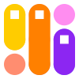

# DesignSpaceEditor2


A RoboFont extension to create and edit designspace version 4 and 5 files. For a specification of the **designspace** 5 format go [to the designspace specification at the FontTools repository](https://fonttools.readthedocs.io/en/latest/designspaceLib/index.html).

This extension can:

* Open, edit and save existing designspace format 4 and format 5 files.
* Start a new designspace files.
* Open source UFOs
* Validate designspaces and point out compatibility and structural issues.

## Usage

1. From the RF extensions menu, open an existing designspace file or create a new one.
1. Define some axes. Give them useful names.
1. Then load some source UFOs.
1. Then save the document in the same folder as your sources, or one level up. The document will store a relative path to the sources and instances.
1. Define instances and whatever else you need to do.
1. Save.


## Axes Tab


**Buttons**

* **Add Weight Axis**: adds a `wght` axis.
* **Add Width Axis**: adds a `wdth` axis.
* **Add Optical Axis**: adds a `opsz` axis.
* **+** add a new axis.
* **-** delete selected axis.

Double click in the (i) icon opens a popover editor for **axis labels** and **axis maps**. The editor represents the labels and maps in a simple syntax for editing. When the panel is closed, the text is converted to designspace objects.

Map syntax:

```
# input value > output value
50 > 10
100 > 20
125 > 66
150 > 990
```

Labels syntax:

```
# if it start with ? it will be a localised axis name
# starts with a ? <language tag> <localised string>
? fr 'Chasse'

# <label name> <value>
'Condensed' 50

# optionally add (elidable) or (olderSibling)
'Normal' 100 (elidable) (olderSibling)

# set a range for a label name
# <label name> <min value> <default value> <max value>
'Extra Wide' 150 150 300

# set a range for a label name
'Extra Light' 200 200 250
# add localisations for this 'Extra Light' label
? de 'Extraleicht'
? fr 'Extra léger'
```

### Sources Tab


This tab shows which UFOs are part of this designspace.

**Buttons**

* **Open UFO** open a file dialog to pick a new UFO. It will be added to the default location. Edit the location!
* **Add Open UFO's** adds all open UFOs as new sources. Edit the location!
* **Replace UFO** Select one of the sources and replace it with a new ufo. 

Double click in the (i) icon opens a popover editor for **Localised Family Name** and **Muted Glyphs**.

**Columns**

* ℹ️ button for the popover editors
* 💾 indicates if the UFO is where we expect it to be
* 📍(TBD)
* **UFO** the UFO filename and path relative to the designspace document
*  **Family Name** family name from the source UFO (some applications look for these names so they do not have to open the UFOs)
*  **Style Name** style name from the source UFO
*  **Layername** name of the layer. Leave blank for default, "foreground"
*  🌐 (TBD)
* 🔕 (TBD)
* [columns for axis values]


Localised Family Name syntax:

```
# starts with a ? <language tag> <localised string>
? fr 'Montserrat'
? ja 'モンセラート'
```

Muted Glyph syntax:

```
# a space separated list of glyph names
a b c d
```

### Instances Tab


This tab shows the instances defined for this designspace.

**Columns**

* **UFO** path and filename of destination UFO (if that is where you want to go obviously)
* **Familiy Name** family name for the UFO
* **Style Name** style name for the UFO
* [columns for axis values]

### Rules Tab


The rules tab is an editor for defining rules and condition sets.

Rules syntax:

```
# a comment
# name of the rule
switching a's
	# a list of source glyph > substituted glyph	a > a.alt
	agrave > agrave.alt
	
	# conditions
	# <axis name> startRange-endRange
	# a condition set with two conditions
	weight 800-1000 width 200-1000
	optical 500-1000	
```

### Labels Tab


The labels tab is an editor for defining labels, ranges etc.

Location Labels syntax:

```
# styleName
Some Style
	# optionally localisation
	# starts with a ? <language tag> <localised string>
	?  fr  "Un Style"
	# optionally translation
	?  fr  "Un Style"
	# location name if the axis and value
	weight 300
	width 40
	Italic 1
	boldness 30
```

### Problems Tab


This tab shows any problems this designspace may have. From problems in construction, missing ufos, missing or duplicate values. 

### History

* 1.0 Initial commit
* 1.1 Fixes a mistake with packaging.
* 1.3.2 UFO paths are editable.
* 1.3.3 Updated designSpaceDocument.
* 1.3.5 Updated designSpaceDocument. ShowSparksTool added.
* 1.3.6 Updated designSpaceDocument. ShowSparksTool made independent.
* 1.9.6
	* Update of this readme
	* Resizable columns thanks [@ryanbugden](https://github.com/ryanbugden)!
	* Quick defaults for axes
	* Replace UFO button
	* Automatic update of UFO name based on `familyName-styleName.ufo`
* 2.0 Rewrite for designspace 5.0 specification
